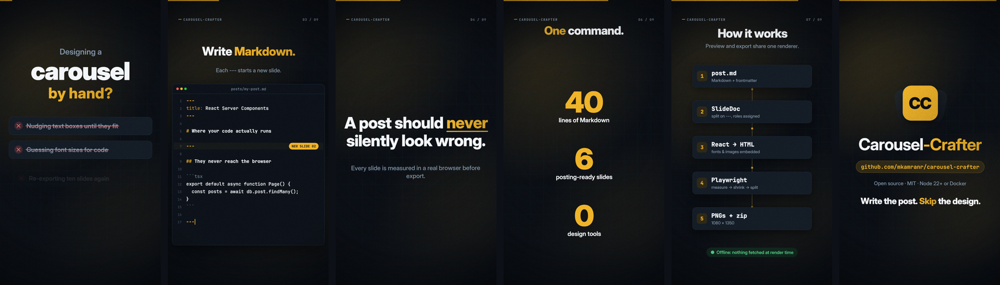
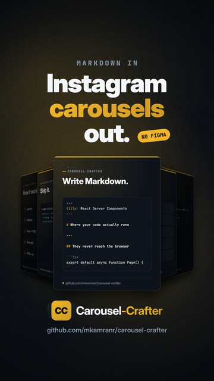
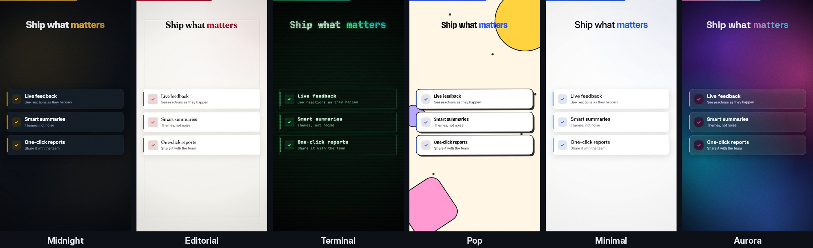

<p align="center">
  
</p>

<h1 align="center">Reelsmith</h1>

<p align="center">
  <b>Topic, description or link in. A 9:16 promo video with voice-over, captions and a cover out.</b><br>
  Every frame is drawn in code, every sound effect is synthesized, and ffmpeg assembles the MP4. It runs on your machine.
</p>

<p align="center">
  <a href="LICENSE"></a>
  
  
  
</p>

<p align="center">
  
</p>

Give Reelsmith a GitHub repo, a Hugging Face model, any web page, or just a topic. A language model plans a storyboard,
the engine animates it frame by frame with camera moves and kinetic type, sound effects land on every cut, and an
optional voice-over narrates it. You get a Reels/Shorts/TikTok-ready MP4, a matching cover image and captions written
for Instagram, Facebook and YouTube.

## Contents

- [Features](#features)
- [Templates](#templates)
- [Quick start](#quick-start)
- [Connect a language model](#connect-a-language-model)
- [Voice-over](#voice-over)
- [Using it](#using-it)
- [What you get](#what-you-get)
- [2K and 4K](#2k-and-4k)
- [Storyboards](#storyboards)
- [How it works](#how-it-works)
- [Render time](#render-time)
- [Troubleshooting](#troubleshooting)
- [Security](#security)
- [Development](#development)
- [License and credits](#license-and-credits)

## Features

- **From a link or a sentence.** Reads GitHub repos (README plus stars, forks, language, licence), Hugging Face
  models and datasets, or any web page. A topic or description on its own works too.
- **Six templates** with their own look, motion, music and writing tone: Midnight, Editorial, Terminal, Pop, Minimal
  and Aurora. Pick one per video; any storyboard works with any template.
- **Ten scene types**, all data-driven: hook, title, code typing, statement, bullet cards, feature panels, counting
  stats, a how-it-works pipeline, terminal and closing card. Text wraps and shrinks to fit, so model output can't overflow.
- **Sound that's in sync by construction.** Each scene registers its sound effects from the same timings that drive
  its animation. A 120 BPM music bed is arranged around the plan, and cuts snap to the beat.
- **Voice-over (optional).** The language model writes a line per scene sized to the scene; any OpenAI-compatible
  text-to-speech server (Kokoro, OpenAI, …) speaks it; the music ducks under the voice; subtitles come out as `.srt`.
- **Any language model.** Ollama, vLLM, LM Studio, OpenRouter, OpenAI, Anthropic, or anything OpenAI-compatible.
  Without one, a built-in planner builds the storyboard from the material itself.
- **Captions and cover.** Platform-specific captions (Instagram, Facebook, YouTube Shorts title, description and tags)
  and a 9:16 cover whose headline stays inside Instagram's grid crop.
- **A job queue with history.** Queue as many videos as you like; they render one after another in the background,
  and the history survives restarts.
- **1080p, 2K or 4K**, either upscaled with ffmpeg or rendered natively (the engine draws vectors).
- **Web app and CLI**, plus a Docker setup with optional Ollama and Kokoro services.

<p align="center">
  
</p>

## Templates

<p align="center">
  
</p>

A template is a whole identity, not just a colour scheme:

| Template | Look | Motion and sound | Writing tone |
|---|---|---|---|
| **Midnight** | dark navy, amber accent, faint grid, Inter | zoom and push cuts, 120 BPM synth pad | confident, developer-friendly |
| **Editorial** | paper-light pages, Fraunces serif headlines, red accent, thin rules | page-turn slides, 90 BPM soft plucks, gentle effects | considered, magazine-like |
| **Terminal** | black CRT with scanlines, all JetBrains Mono, phosphor glow, square corners | glitch cuts, 128 BPM chiptune arpeggios | terse and technical |
| **Pop** | cream with big colour shapes that change every scene, thick outlines, hard shadows, Bricolage Grotesque | bouncy cuts, 128 BPM claps and stabs | playful and punchy |
| **Minimal** | near-white, light-weight type, soft shadows, blue accent | quiet crossfades, 100 BPM airy pad, soft effects | calm and premium |
| **Aurora** | deep violet with moving gradient light, frosted-glass cards, Space Grotesk | dissolves, 110 BPM lush pad with shimmer | visionary launch |

The template also steers the planner: its tone goes into the prompt, along with the scene types that suit it (Terminal
leans on code and commands, Editorial on statements and numbers). Pick one in the web app's **Template** picker, which
shows a live preview of each, or with `--template` on the command line (`reelsmith templates` lists them).

**Accent colour:** a colour you choose always wins and stays if you switch templates. Otherwise Midnight lets the
planner pick an accent to suit the content, and every other template keeps its designed palette.

## Quick start

### Docker (recommended)

```bash
git clone https://github.com/mkamranr/reelsmith.git
cd reelsmith
cp .env.example .env            # optional: port, keys, allowed host names
docker compose up -d --build
```

Open <http://localhost:5179>, then **Settings** to connect a language model (and a voice, if you want narration).
Videos and settings live in the `reelsmith-data` volume, so they survive rebuilds.

Optional companion services:

```bash
docker compose --profile ollama up -d    # a local LLM;    set REELSMITH_OLLAMA_URL=http://ollama:11434 in .env
docker compose --profile kokoro up -d    # local voices;   set REELSMITH_TTS_URL=http://kokoro:8880/v1 in .env
```

### Without Docker

Needs Python 3.10+ and ffmpeg (`brew install ffmpeg`, `sudo apt install ffmpeg` or `winget install ffmpeg`).

```bash
git clone https://github.com/mkamranr/reelsmith.git
cd reelsmith
python -m venv .venv && source .venv/bin/activate     # Windows: .venv\Scripts\activate
pip install -e .                                      # adds a `reelsmith` command
reelsmith serve                                       # → http://localhost:5179
```

Try it without any model or network access, using the bundled example:

```bash
reelsmith render examples/carousel-crafter.json --draft
```

## Connect a language model

Open **Settings → Language model**, pick a provider, press **Test connection**, then **Save**.

| Provider | Default endpoint | Key | Notes |
|---|---|---|---|
| Ollama | `http://localhost:11434` | no | Uses Ollama's native API so the context window (`num_ctx`) is honoured |
| vLLM | `http://localhost:8000/v1` | optional | Model name must match `vllm serve <model>` |
| LM Studio | `http://localhost:1234/v1` | no | Start the server in the Developer tab |
| OpenRouter | `https://openrouter.ai/api/v1` | yes | Retries overloaded providers and rate limits for about 75 s |
| OpenAI | `https://api.openai.com/v1` | yes | |
| Anthropic | `https://api.anthropic.com` | yes | |
| Other OpenAI-compatible | anything serving `/v1/chat/completions` | optional | llama.cpp server, LocalAI, TGI, a company gateway… |

**Find models** lists what the endpoint serves. Advanced settings cover extra headers, timeout, max output tokens,
temperature, JSON mode and how much of a fetched page is sent (keep it small for small local models). Servers that
reject JSON mode are retried without it, `<think>` blocks are stripped, and when a reasoning model spends its output
budget thinking, the budget is raised automatically.

From the terminal:

```bash
reelsmith config set --provider ollama --model llama3.1:8b
reelsmith config set --provider openrouter --model <vendor/model> --api-key sk-or-...
reelsmith config test
```

Settings are stored in `~/.config/reelsmith/config.json` (in Docker, `/data/config/`), readable only by you. The web
app only ever sees keys masked. Environment variables (`ANTHROPIC_API_KEY`, `OPENAI_BASE_URL` + `OPENAI_API_KEY`,
`OLLAMA_HOST`, `REELSMITH_MODEL`) are used when nothing is saved. `GITHUB_TOKEN` (any read-only token) lifts GitHub's
60-requests-per-hour anonymous limit and adds repo stats to what the planner can use.

**Choosing a model:** a fast, non-reasoning model works best, since every video makes three or more calls (storyboard,
narration, captions). If you use a reasoning model, set **Max output tokens** to about 8000.

## Voice-over

Set up a voice in **Settings → Voice**, then tick **Add a voice-over** on any job. Unticked, no speech is generated.

| Provider | Default endpoint | Model | Voices |
|---|---|---|---|
| Kokoro (e.g. Kokoro-FastAPI) | `http://localhost:8880/v1` | `kokoro` | `af_heart`, `am_michael`, `bf_emma`, … |
| OpenAI | `https://api.openai.com/v1` | `gpt-4o-mini-tts` | `alloy`, `nova`, `shimmer`, … |
| Other OpenAI-compatible | anything serving `POST /v1/audio/speech` | | |

**Load voices** reads the server's voice list (it tries the common endpoints; if your server has none, it suggests the
standard Kokoro voices). **Play a sample** is the reliable check that your server accepts a voice name.

How narration is made:

1. The language model writes one spoken line per scene, sized to the scene (about 2.6 words a second, adjusted for
   speed), meant to be heard over the on-screen text rather than read word for word. URLs, hashtags, handles and emoji
   are removed so they're never read aloud.
2. Each line is spoken and fitted into its scene. A line that's too long is rewritten shorter, then sped up without
   changing pitch (ffmpeg `atempo`, up to 1.35×), and only trimmed with a fade as a last resort.
3. Music and sound effects duck under the voice and come back up between lines.

If the model's reply can't be used, the narration falls back to the on-screen text and the job log shows what the
model sent. From the terminal: `reelsmith voice set --provider kokoro --base-url http://localhost:8880/v1 --voice af_heart`,
then `reelsmith voice test` and `reelsmith generate … --voiceover`.

## Using it

### Web app

Fill in the brief (topic, description and/or link, template, length, accent colour, your handle), choose **Draft preview**
(540p, about 4× faster) or **Full 1080 × 1920**, optionally 2K/4K and a voice-over, then:

- **Make video** adds a job to the queue. Keep adding more; they render one after another.
- **Plan storyboard** shows the plan first. Edit the JSON (any text, scene order, accent), then **Render this storyboard**.

The **Jobs** list shows every job with its status, queue position and progress. Open one to watch it, cancel it, run it
again, download its files or delete it. Queued jobs carry on after a restart; a job interrupted by a restart can be
run again with one click.

### Command line

```bash
reelsmith generate --url https://github.com/owner/repo --duration 45
reelsmith generate --url https://github.com/owner/repo --template terminal     # see `reelsmith templates`
reelsmith generate --topic "Why sourdough needs time" --description "..." --duration 30 --accent "#5BD1A9" --voiceover
reelsmith generate --url https://example.com/post --draft                      # quick 540p preview
reelsmith generate --url https://github.com/owner/repo --upscale 4k            # also write a 4K file
reelsmith plan --url https://github.com/owner/repo -o storyboard.json          # plan only, then edit it
reelsmith render storyboard.json
reelsmith render storyboard.json --template pop                                # same story, another look
```

Add `--no-llm` to use the built-in planner, `--workers N` to limit CPU use and `-o DIR` to choose the output folder.
`reelsmith --help` lists everything.

## What you get

Each run writes a folder containing:

| File | What it is |
|---|---|
| `video.mp4` | 1080 × 1920, 30 fps, H.264 + AAC stereo |
| `video-2k.mp4` / `video-4k.mp4` | upscaled copy, when requested |
| `cover.png` | 9:16 cover, at the video's resolution |
| `captions.md`, `captions.json` | Instagram, Facebook and YouTube Shorts captions |
| `narration.srt`, `narration.json`, `voiceover.wav` | subtitles, script with timings and the voice on its own (voice-over jobs) |
| `storyboard.json` | the plan that was rendered, including the timing actually used |
| `source.json`, `manifest.json` | what was read from your link, and a summary of the run |

## 2K and 4K

Final renders are 1080 × 1920. Add `--upscale 2k` (1440 × 2560) or `--upscale 4k` (2160 × 3840), or pick
**Also export at** in the web app.

| Method | What happens | Cost | Output |
|---|---|---|---|
| `ffmpeg` (default) | the 1080p render is upscaled with Lanczos and a light luma-only sharpen | one extra encode pass | 1080p file plus the upscaled one |
| `native` | every frame is drawn at the target size | about 1.8× (2K) or 4× (4K) render time | one file at 2K/4K |

`ffmpeg` gives slightly crisper edges but can't add detail; `native` gives genuinely sharper text. YouTube Shorts keeps
up to 4K. Instagram and Facebook re-compress to about 1080p, so there a higher-resolution upload mainly gives their
encoder a cleaner source.

## Storyboards

The planner (or you) writes a storyboard; the engine handles timing and layout.

```json
{
  "name": "Carousel-Crafter", "template": "midnight", "duration": 45,
  "scenes": [
    { "type": "hook", "kicker": "Designing a", "big": "carousel", "punch": "by hand?" },
    { "type": "code", "caption": "Write Markdown.", "accent": "Markdown", "language": "markdown", "lines": ["# Hello", "---"] },
    { "type": "cta", "name": "Carousel-Crafter", "url": "github.com/mkamranr/carousel-crafter", "line": "Write the post. Skip the design." }
  ],
  "cover": { "kicker": "Markdown in", "lines": ["Instagram", "carousels", "out."], "accent_line": 1, "badge": "No Figma" }
}
```

| Type | Fields |
|---|---|
| `hook` | `kicker`, `big` (one huge word), `punch`, `pains` (0–3, crossed out), `answer`, `accent` |
| `title` | `name`, `tagline`, `initials` |
| `code` | `caption`, `accent`, `subtitle`, `filename`, `language`, `lines`, `callouts` (`[{line, label}]`) |
| `statement` | `text`, `accent` (words to underline), `sub` |
| `bullets` | `caption`, `accent`, `subtitle`, `items` (`[{title, sub}]`), `checks` |
| `features` | `items` (`[{title, subtitle, points}]`); the camera pans between panels |
| `stats` | `caption`, `accent`, `subtitle`, `items` (`[{value, label}]`); numbers count up |
| `steps` | `title`, `subtitle`, `steps` (`[{title, sub}]`), `footer` |
| `terminal` | `caption`, `accent`, `command`, `outputs` (prefix `✓ ` for green lines) |
| `cta` | `name`, `url`, `tagline`, `line`, `accent` |

`template` is any of the six ids. Scenes are fitted to `duration` with cuts on the template's beat. If the minimums don't fit, lower-priority middle scenes are
dropped (content is kept over the title card). See [`examples/carousel-crafter.json`](examples/carousel-crafter.json).

## How it works

```
link / topic ──► read source ──► plan storyboard (LLM or built-in) ──► narration + TTS (optional)
                                                                              │
cover.png ◄── captions ◄── encode + mux ◄── render frames on every core ◄─────┘
                               ▲
          synthesized SFX + music bed, ducked under the voice
```

1. **Read**: GitHub and Hugging Face get their README/model card and stats; other pages are reduced to readable text.
2. **Plan**: the model gets a catalogue of scene types with field limits and returns JSON, which is validated and
   clamped (unknown scenes dropped, missing hook/CTA added, over-long text trimmed, stats without a number dropped).
3. **Time**: scenes get durations from their content, fitted to your length and snapped to a 0.5 s beat grid.
4. **Narrate** (optional): lines written per scene, spoken, fitted, levelled.
5. **Render**: every frame is drawn with [skia](https://github.com/kyamagu/skia-python) as vectors in a 1080 × 1920
   design space, split across CPU cores, each core encoding its own segment.
6. **Sound**: sound effects (whooshes, key clicks, impacts, chimes, risers…) are synthesized with numpy/scipy and placed
   at the times the scenes registered; the music bed follows the plan; everything is mixed and limited.
7. **Assemble**: segments are joined without re-encoding, audio is muxed, then the cover and captions are made.

## Render time

Rendering is CPU-bound and uses every core. Roughly 0.4 s per 1080p frame per core:

| Video | 1 core | 8 cores |
|---|---|---|
| 30 s, final 1080p | ~6 min | ~1 min |
| 30 s, draft 540p | ~1.5 min | ~15 s |

Native 2K takes about 1.8× as long and native 4K about 4×. The ffmpeg upscale of a 15 s video took about 2.3 min (2K)
and 4.3 min (4K) on one core; x264 uses all cores, so it's several times faster on a typical machine.

## Troubleshooting

**"Could not reach http://localhost:…" in Docker.** Inside the container, `localhost` is the container itself, not
your computer. Use `http://host.docker.internal:<port>` and make sure the server on your computer listens on
`0.0.0.0`, not only `127.0.0.1` (Ollama: `OLLAMA_HOST=0.0.0.0 ollama serve`; vLLM: `--host 0.0.0.0`). Reelsmith
detects this and suggests the right URL, both in errors and as you type.

**"Upstream error … Service temporarily overloaded" (OpenRouter).** The provider behind your model is busy.
Reelsmith retries for about 75 s; after that, use **Run again** later or pick a model served by several providers,
which OpenRouter can fall back between.

**"ran out of output tokens".** A reasoning model used its budget thinking. Raise **Max output tokens** in Settings or
choose a model without extended reasoning.

**Narration fell back to the on-screen text.** The job log shows what the model replied. Most shapes are understood
(`{"lines": […]}`, bare lists, per-scene objects, numbered keys); open an issue with the log if yours isn't.

**Voices: "Load voices" finds nothing.** Your server doesn't publish a list. Type the voice name you use with it and
press **Play a sample** to check.

**GitHub: no stars or licence in the facts.** The anonymous API limit (60 requests an hour) was hit and only the
README was read. Set `GITHUB_TOKEN`.

**After updating, nothing changed (Docker).** Rebuild the image: `docker compose up -d --build`. The startup log and
`/api/status` show the running version.

## Security

- The web app has no login. It binds to `127.0.0.1`, and Docker publishes it on the host's loopback only. It refuses
  requests addressed to other host names or coming from other sites, so a web page open in your browser can't change
  your settings or start jobs. To use it from another device, set `REELSMITH_BIND=0.0.0.0` and
  `REELSMITH_ALLOWED_HOSTS=<ip>:5179`; anyone who can reach that port can then use your API credits, so beyond a
  trusted network put it behind a reverse proxy with authentication.
- The URL reader refuses hosts that resolve to private, loopback or link-local addresses
  (`REELSMITH_ALLOW_PRIVATE=1` to allow, e.g. for an intranet page).
- Text from fetched pages is passed to the model as reference data, not instructions. The planner is told not to
  invent numbers, benchmarks or quotes, but read the script before posting.
- Settings files containing keys are written with owner-only permissions; the browser only sees keys masked.

## Development

```bash
pip install -e .
python -m unittest discover -s tests       # needs ffmpeg for the upscale test
```

```
reelsmith/
  cli.py, server.py, pipeline.py      entry points and orchestration
  jobs.py                             persistent job queue and history
  sources.py                          GitHub / Hugging Face / web page reader
  llm.py, config.py                   language-model client and saved settings
  storyboard.py, captions.py          planning, validation, captions
  tts.py, narration.py                voice settings, TTS client, narration writing and fitting
  engine/
    templates.py                      the six templates: palette, type, shape, background, motion, music, tone
    lib.py, highlight.py              drawing primitives, text fitting with font fallback, syntax colours
    scenes.py, timeline.py            scene types, timing, transitions
    audio.py, render.py, upscale.py   SFX + music + ducking, parallel rendering, 2K/4K
    cover.py                          cover image
  previews.py                         template picker thumbnails (rendered once, cached)
  web/index.html                      the web app (no build step)
docs/                                 icon and README images
examples/                             a sample storyboard
```

Contributions are welcome; see [CONTRIBUTING.md](CONTRIBUTING.md).

## License and credits

[MIT](LICENSE). Bundled fonts are [Inter](https://github.com/rsms/inter),
[JetBrains Mono](https://github.com/JetBrains/JetBrainsMono), [Fraunces](https://github.com/undercasetype/Fraunces),
[Bricolage Grotesque](https://github.com/ateliertriay/bricolage) and
[Space Grotesk](https://github.com/floriankarsten/space-grotesk), all under the SIL Open Font License (see
`reelsmith/fonts/`). Built on [skia-python](https://github.com/kyamagu/skia-python), [NumPy](https://numpy.org),
[SciPy](https://scipy.org) and [FFmpeg](https://ffmpeg.org).
